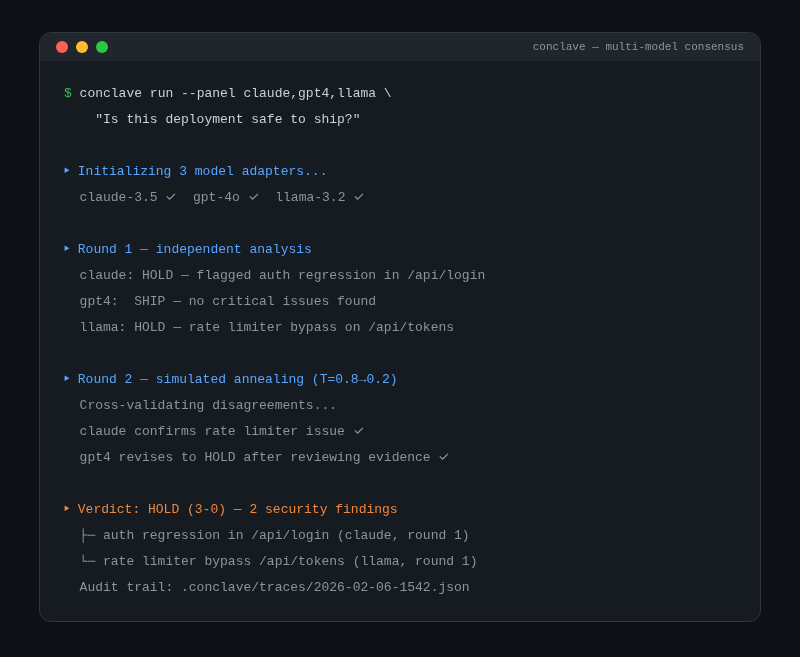

<div align="center">
  
  <h1>Agent Conclave</h1>
  <p><strong>Multi-model consensus engine — local agents self-organize and iterate until an agreed best solution is reached</strong></p>
  <p>
    <a href="https://tannner.com">tannner.com</a> ·
    <a href="https://github.com/tannernicol/agent-conclave">GitHub</a>
  </p>
</div>

---

<p align="center">
  
</p>

## What it does

For agent users who find themselves constantly copy/pasting between different models until they reach consensus on high leverage decisions. Conclave automates a set of local agents self-organizing based on their relative strengths and iterating until an agreed best solution is reached. Uses simulated annealing for randomness and will reconcile with past results to over time find its optimal answer.

## Key features

- **Model-agnostic adapters** for local, hosted, and self-hosted LLMs (Ollama, OpenAI, Anthropic)
- **Configurable consensus strategies** with deterministic replay and simulated annealing
- **Policy hooks and guardrails** for sensitive workflows
- **Full audit trails** with replayable traces — every decision is reproducible

## Quick start

```bash
git clone https://github.com/tannernicol/agent-conclave.git
cd agent-conclave
python -m venv .venv && source .venv/bin/activate
pip install -r requirements.txt

cp config/example.yaml config/local.yaml
# Edit config/local.yaml with your model endpoints

python scripts/demo.py --config config/local.yaml
```

```
$ conclave run --query "Is this deployment safe to ship?"
→ Panel: 3 models, 12 reasoning chains
→ Verdict: HOLD (2-1) — claude flagged auth regression
```

## How it works

1. **Fan-out** — sends the same prompt to N models in parallel
2. **Score** — each response is scored against configurable rubrics
3. **Iterate** — models see each other's responses and refine (simulated annealing controls exploration)
4. **Converge** — stops when consensus threshold is met or max rounds reached
5. **Audit** — full decision trace written to JSON for reproducibility

## Author

**Tanner Nicol** — [tannner.com](https://tannner.com) · [GitHub](https://github.com/tannernicol) · [LinkedIn](https://linkedin.com/in/tanner-nicol-60b21126)
