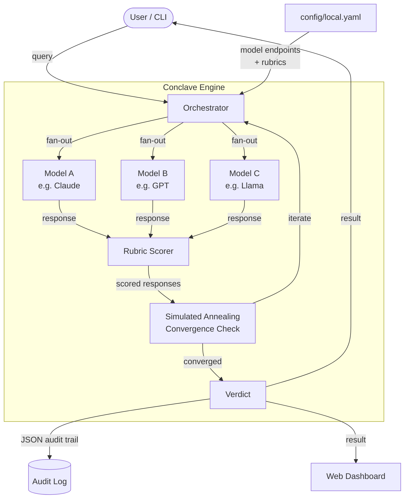

<div align="center">
  
  <h1>Agent Conclave</h1>
  <p><strong>Multi-model consensus engine — local agents self-organize and iterate until an agreed best solution is reached</strong></p>
  <p>
    <a href="https://tannner.com">tannner.com</a> ·
    <a href="https://github.com/tannernicol/agent-conclave">GitHub</a>
  </p>

[](https://github.com/tannernicol/agent-conclave/actions/workflows/ci.yml)
</div>

---

<p align="center">
  
</p>

## The Problem

You're making a high-stakes decision — shipping a deploy, choosing an architecture, reviewing a security change. You ask Claude. Then you ask GPT. Then you ask Llama. You copy-paste between tabs, mentally diff the answers, and try to synthesize a verdict. Every time.

## The Solution

Conclave automates multi-model deliberation. Send one query, get structured consensus from N models that see each other's reasoning and iterate until they converge. Simulated annealing controls exploration vs. exploitation. Every decision produces a replayable audit trail.

**One query in, one verdict out. No more copy-paste consensus.**

## Key Features

- **Model-agnostic adapters** for local, hosted, and self-hosted LLMs (Ollama, OpenAI, Anthropic)
- **Multi-round deliberation** — models cross-validate each other's reasoning
- **Configurable consensus strategies** with deterministic replay and simulated annealing
- **Policy hooks and guardrails** for sensitive workflows
- **Full audit trails** with replayable traces — every decision is reproducible

## Quick Start

```bash
git clone https://github.com/tannernicol/agent-conclave.git
cd agent-conclave
python -m venv .venv && source .venv/bin/activate
pip install -e .

# Edit config/example.yaml with your model endpoints
# (defaults to two local Ollama models)

python examples/demo.py --list          # see built-in demo questions
python -m pytest tests/ -q              # run tests
```

```
$ python examples/demo.py --list
Available demo questions:
  1. [creative]     What are the top 3 sci-fi films of all time and why?
  2. [research]     If humanity could only bring one invention to Mars...
  3. [code_review]  Functional vs OOP for large-scale systems?
  4. [general]      Most impactful invention of the last 100 years?
```

## How It Works

1. **Fan-out** — sends the same prompt to N models in parallel
2. **Score** — each response is scored against configurable rubrics
3. **Iterate** — models see each other's responses and refine (simulated annealing controls exploration)
4. **Converge** — stops when consensus threshold is met or max rounds reached
5. **Audit** — full decision trace written to JSON for reproducibility

## Agent Bus

Conclave includes a lightweight JSONL message bus for inter-agent coordination. Agents append messages to a shared file and read from cursor-tracked positions — no server process needed.

```python
from conclave.bus import MessageBus

bus = MessageBus("/tmp/conclave-bus")
bus.post("reviewer", subject="Found regression", body="Auth test failing", auto_inject=True)

# Another agent reads new messages
msgs = bus.read("fixer")

# Get injectable context for an LLM prompt
context = bus.format_context("fixer")
```

Messages support priority levels, TTL expiration, recipient filtering, and auto-injection into LLM context windows. See `examples/multi_agent.py` for a full walkthrough.

## Threat Model

**In scope — what Conclave defends against:**

- **Model disagreement masking** — a single model's hallucination or confident-but-wrong answer is surfaced by cross-validation from other models, not silently accepted
- **Prompt drift across rounds** — simulated annealing and convergence thresholds prevent models from wandering off-topic during multi-round deliberation
- **Audit gap** — every deliberation round, every chain of thought, and every vote is persisted as replayable JSON; decisions are never opaque
- **Vendor lock-in** — model-agnostic design means no single provider failure degrades the system; swap Ollama, OpenAI, or Anthropic without code changes

**Out of scope — what Conclave intentionally does not defend against:**

- **Compromised model backends** — if an upstream API or local Ollama instance is serving poisoned weights, Conclave has no way to detect that; it trusts model outputs at face value
- **Prompt injection in the query itself** — Conclave passes user queries to models without sanitization; adversarial prompts embedded in the input will reach all panelists
- **Confidentiality of deliberation content** — queries and responses are sent to whichever model backends are configured, including cloud APIs; do not send secrets through cloud-routed panels
- **Consensus correctness** — agreement among models does not guarantee factual accuracy; Conclave reduces variance, not ground-truth error

## Architecture



## Requirements

- Python 3.10+
- At least one LLM provider (Ollama for local, or OpenAI/Anthropic API keys)

## Author

**Tanner Nicol** — [tannner.com](https://tannner.com) · [GitHub](https://github.com/tannernicol) · [LinkedIn](https://linkedin.com/in/tanner-nicol-60b21126)

## License

MIT — see [LICENSE](LICENSE).
