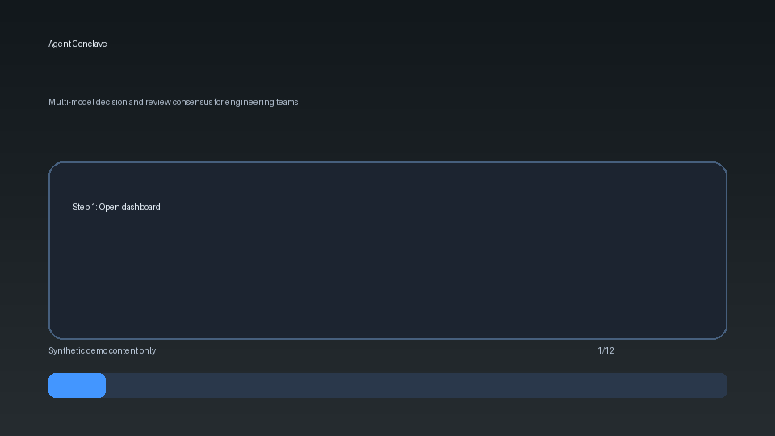
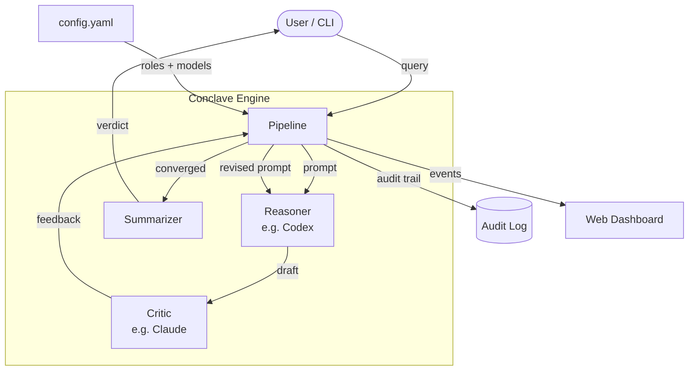

<div align="center">
  
  <h1>Agent Conclave</h1>
  <p><strong>Get a second AI opinion without being human middleware</strong></p>
  <p>
    <a href="https://tannner.com">tannner.com</a> ·
    <a href="https://github.com/tannernicol/agent-conclave">GitHub</a>
  </p>

[](https://github.com/tannernicol/agent-conclave/actions/workflows/ci.yml)
</div>

---

<p align="center">
  
</p>

## The Problem

You want multiple AI perspectives on an important decision. So you ask Claude. Then GPT. Then Gemini. You copy-paste between tabs, mentally diff the answers, and try to synthesize a verdict. You become human middleware between models that could be talking to each other directly.

## The Solution

Conclave makes AI agents debate each other so you don't have to. A **Reasoner** builds the case, a **Critic** tears it apart, and they iterate until they converge — or agree to disagree. Like the papal conclave: white smoke when they agree, black smoke when they don't.

**One query in, one verdict out. No more copy-paste consensus.**

```
$ conclave run --query "Is a hot dog a sandwich?" --progress

14:08:07 calibration skipped
14:08:14 route done  reasoner->codex  critic->claude  summarizer->claude
14:08:15 deliberate round 1/5 start
14:08:15 deliberate round 1/5 reasoner->codex thinking... (timeout 300s)
14:08:47 deliberate round 1/5 reasoner->codex done (32s) — Codex: yes, structurally a sandwich
14:08:47 deliberate round 1/5 critic->claude thinking... (timeout 300s)
14:09:21 deliberate round 1/5 critic->claude done (34s) — Claude: "function over geometry" is too permissive
14:09:21 deliberate round 1 ██ black smoke DISAGREE (3 issues)
14:09:21 deliberate round 2/5 start
14:09:21 deliberate round 2/5 reasoner->codex thinking... (timeout 300s)
14:09:48 deliberate round 2/5 reasoner->codex done (27s) — Codex: revised with exclusionary boundary
14:09:48 deliberate round 2/5 critic->claude thinking... (timeout 300s)
14:10:19 deliberate round 2/5 critic->claude done (31s) — Claude: AGREE with caveats
14:10:19 deliberate round 2 ☁️ white smoke AGREE
14:10:19 deliberate done

→ Consensus: A hot dog is structurally a sandwich — filling
  placed within discrete bread, eaten by hand. But it operates
  as a distinct culinary category in practice. Call it "hot dog"
  on menus, "sandwich" in taxonomies.
  Confidence: medium-high

  Resolved: Codex's "function over geometry" argument was too
  permissive (would include burritos). Revised to require
  discrete bread, not wrapped dough.

  Still split: Whether the exclusionary boundary is ad hoc.
  Claude flags it works but could break on edge cases (pita?).
```

### Annealing: Multi-Run Convergence

For subjective questions, a single deliberation might miss the best answer. **Simulated annealing** runs multiple deliberations with decreasing randomness — each run considers a different perspective, and the best-scoring answer wins.

```
$ conclave run \
    --query "What is the single best rain jacket to own if you live in Seattle?" \
    --max-seconds 900 --no-fail-on-insufficient --progress

14:19:44 route done  reasoner->codex  critic->claude  summarizer->claude
14:19:54 anneal run 1/3 start T=1.2
14:19:54 deliberate round 1/5 start
14:19:54 deliberate round 1/5 reasoner->codex thinking... (timeout 300s)
14:20:28 deliberate round 1/5 reasoner->codex done (33s) — Product Recommendation
14:20:28 deliberate round 1/5 critic->claude thinking... (timeout 300s)
14:21:21 deliberate round 1/5 critic->claude done (53s) — AGREE: Breathability weighting understated...
14:21:21 deliberate round 1 ☁️ white smoke AGREE
14:21:21 anneal run 1/3 accepted score=0.8 best=0.8

14:21:21 anneal run 2/3 start T=0.75 "Consider what could go wrong."
14:21:21 deliberate round 1/5 reasoner->codex thinking...
14:22:19 deliberate round 1/5 reasoner->codex done (58s) — Product Recommendation
14:22:57 deliberate round 1/5 critic->claude done (37s) — DISAGREE: daily-wear tradeoff ignored...
14:22:57 deliberate round 1 ▇▇ black smoke DISAGREE (3 issues)
14:23:22 deliberate round 2/5 reasoner->codex done (25s) — Single Best Pick
14:23:58 deliberate round 2/5 critic->claude done (36s) — AGREE: daily-wear tradeoff resolved
14:23:58 deliberate round 2 ☁️ white smoke AGREE
14:23:58 anneal run 2/3 accepted score=0.78 best=0.8

14:23:58 anneal run 3/3 start T=0.3 "Focus on practical constraints."
14:24:35 deliberate round 1/5 reasoner->codex done (37s) — Product Recommendation
14:25:09 deliberate round 1/5 critic->claude done (34s) — AGREE
14:25:09 deliberate round 1 ☁️ white smoke AGREE
14:25:09 anneal run 3/3 accepted score=0.8 best=0.8
14:25:09 anneal done (3 runs, best=0.8)

→ Patagonia Torrentshell 3L (~$179) — 3-layer waterproof,
  pit zips for Seattle's humid drizzle, Ironclad Guarantee.
  Run 2's "what could go wrong" lens caught the daily-wear
  tradeoff that Run 1 missed (Gore-Tex shells are overkill).
  Confidence: medium
```

Each run used a different **perturbation** — a perspective-shift prepended to the query. Run 2's "consider what could go wrong" forced the Critic to flag that a technical shell isn't the best *daily* jacket, producing a more nuanced final answer than any single deliberation would.

## How It Works

1. **Route** — assigns roles based on model strengths (Reasoner, Critic, Summarizer)
2. **Reason** — the Reasoner builds a detailed analysis
3. **Critique** — the Critic challenges assumptions, finds flaws, and lists disagreements
4. **Iterate** — the Reasoner revises based on critique; repeat until convergence
5. **Smoke signal** — ☁️ white smoke on agreement, ██ black smoke on disagreement
6. **Summarize** — a final structured verdict with confidence level and audit trail

Fast-path: when all roles are pre-assigned, calibration and scoring are skipped entirely — deliberation starts in seconds.

## Key Features

- **Adversarial deliberation** — models argue FOR and AGAINST, not just answer in parallel
- **Live progress** — see every round, every model thinking, every agree/disagree in real-time
- **Model-agnostic** — works with any CLI-invocable model (Claude, Codex, Gemini, Ollama, etc.)
- **Role overrides** — assign specific models to Reasoner/Critic/Summarizer roles
- **Full audit trails** — every deliberation round persisted as replayable JSON
- **Web dashboard** — view runs, events, and deliberation history in the browser

## Quick Start

```bash
git clone https://github.com/tannernicol/agent-conclave.git
cd agent-conclave
python -m venv .venv && source .venv/bin/activate
pip install -e .

# Edit config/example.yaml with your model endpoints
conclave health                    # verify models are reachable
conclave run --query "test" --progress  # run a quick deliberation
python -m pytest tests/ -q         # run tests
```

## Configuration

```yaml
# config/example.yaml — minimal setup with two local models
models:
  cards:
    - id: cli:model-a
      command: [ollama, run, llama3.2]
      prompt_mode: arg
    - id: cli:model-b
      command: [ollama, run, qwen2.5:7b]
      prompt_mode: arg

# Assign roles — who reasons, who critiques
planner:
  role_overrides:
    reasoner: cli:model-a
    critic: cli:model-b
    summarizer: cli:model-b

deliberation:
  max_rounds: 5
  stability_rounds: 2         # stop after 2 consecutive agreements
  model_timeout_seconds: 300
```

## Agent Bus

Conclave includes a lightweight JSONL message bus for inter-agent coordination. Agents append messages to a shared file and read from cursor-tracked positions — no server process needed.

```python
from conclave.bus import MessageBus

bus = MessageBus("/tmp/conclave-bus")
bus.post("reviewer", subject="Found regression", body="Auth test failing", auto_inject=True)

# Another agent reads new messages
msgs = bus.read("fixer")

# Get injectable context for an LLM prompt
context = bus.format_context("fixer")
```

Messages support priority levels, TTL expiration, recipient filtering, and auto-injection into LLM context windows. See `examples/multi_agent.py` for a full walkthrough.

## Threat Model

**In scope — what Conclave defends against:**

- **Model disagreement masking** — a single model's hallucination or confident-but-wrong answer is surfaced by cross-validation from other models, not silently accepted
- **Prompt drift across rounds** — convergence thresholds prevent models from wandering off-topic during multi-round deliberation
- **Audit gap** — every deliberation round, every chain of thought, and every vote is persisted as replayable JSON; decisions are never opaque
- **Vendor lock-in** — model-agnostic design means no single provider failure degrades the system; swap providers without code changes

**Out of scope — what Conclave intentionally does not defend against:**

- **Compromised model backends** — if an upstream API or local instance is serving poisoned weights, Conclave has no way to detect that; it trusts model outputs at face value
- **Prompt injection in the query itself** — Conclave passes user queries to models without sanitization; adversarial prompts embedded in the input will reach all panelists
- **Confidentiality of deliberation content** — queries and responses are sent to whichever model backends are configured, including cloud APIs; do not send secrets through cloud-routed panels
- **Consensus correctness** — agreement among models does not guarantee factual accuracy; Conclave reduces variance, not ground-truth error

## Architecture



## Requirements

- Python 3.10+
- At least one LLM accessible via CLI (Ollama for local, or Claude/Codex/Gemini CLIs)

## Author

**Tanner Nicol** — [tannner.com](https://tannner.com) · [GitHub](https://github.com/tannernicol) · [LinkedIn](https://linkedin.com/in/tanner-nicol-60b21126)

## License

MIT — see [LICENSE](LICENSE).
