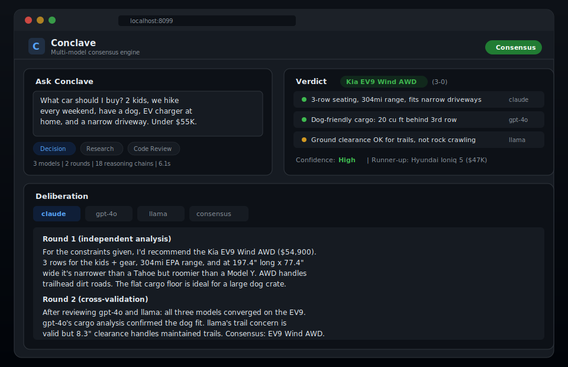

<div align="center">
  
  <h1>Agent Conclave</h1>
  <p><strong>Multi-model consensus engine — local agents self-organize and iterate until an agreed best solution is reached</strong></p>
  <p>
    <a href="https://tannner.com">tannner.com</a> ·
    <a href="https://github.com/tannernicol/agent-conclave">GitHub</a>
  </p>

[](https://github.com/tannernicol/agent-conclave/actions/workflows/ci.yml)
[](https://www.python.org/downloads/)
[](LICENSE)
</div>

---

<p align="center">
  
</p>

## The Problem

You're making a high-stakes decision — shipping a deploy, choosing an architecture, reviewing a security change. You ask Claude. Then you ask GPT. Then you ask Llama. You copy-paste between tabs, mentally diff the answers, and try to synthesize a verdict. Every time.

## The Solution

Conclave automates multi-model deliberation. Send one query, get structured consensus from N models that see each other's reasoning and iterate until they converge. Simulated annealing controls exploration vs. exploitation. Every decision produces a replayable audit trail.

**One query in, one verdict out. No more copy-paste consensus.**

## Key Features

- **Model-agnostic** — Ollama, OpenAI, Anthropic, or any combination
- **Multi-round deliberation** — models cross-validate each other's reasoning
- **Configurable consensus** — deterministic replay, simulated annealing, custom rubrics
- **Policy guardrails** — enforce constraints on sensitive workflows
- **Full audit trails** — every chain of thought saved as replayable JSON
- **Web dashboard** — real-time deliberation view with verdict, findings, and model tabs

## Quick start

```bash
git clone https://github.com/tannernicol/agent-conclave.git
cd agent-conclave
python -m venv .venv && source .venv/bin/activate
pip install -r requirements.txt

cp config/example.yaml config/local.yaml
# Edit config/local.yaml with your model endpoints

python scripts/demo.py --config config/local.yaml
```

```
$ conclave run --query "Is this deployment safe to ship?"
→ Panel: 3 models, 12 reasoning chains
→ Verdict: HOLD (2-1) — claude flagged auth regression
```

## How it works

1. **Fan-out** — sends the same prompt to N models in parallel
2. **Score** — each response is scored against configurable rubrics
3. **Iterate** — models see each other's responses and refine (simulated annealing controls exploration)
4. **Converge** — stops when consensus threshold is met or max rounds reached
5. **Audit** — full decision trace written to JSON for reproducibility

## Author

**Tanner Nicol** — [tannner.com](https://tannner.com) · [GitHub](https://github.com/tannernicol) · [LinkedIn](https://linkedin.com/in/tanner-nicol-60b21126)
